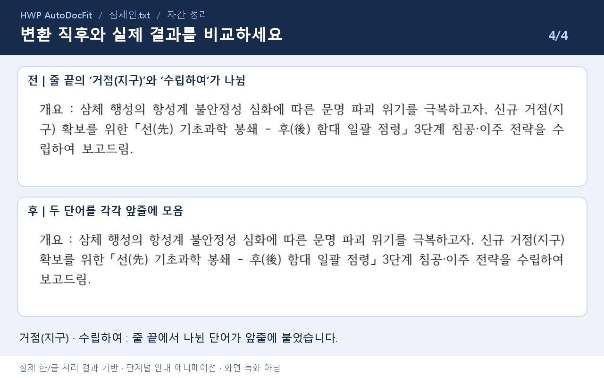
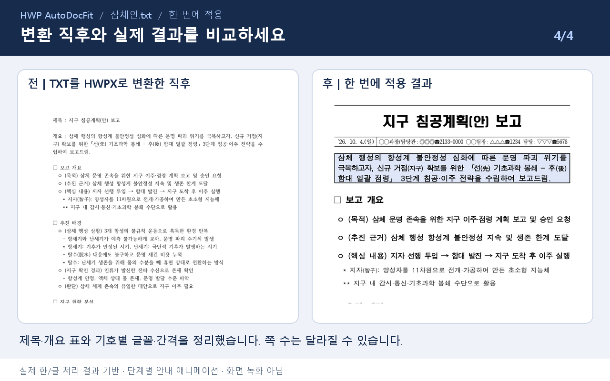
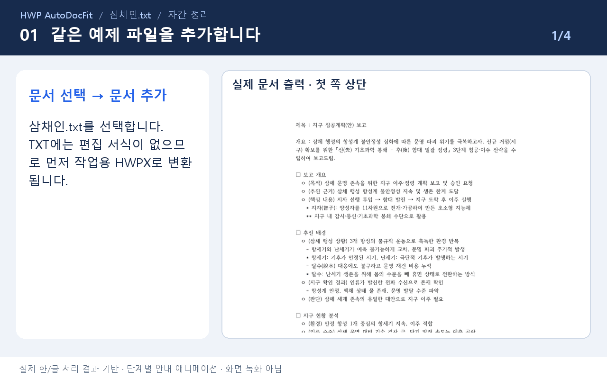
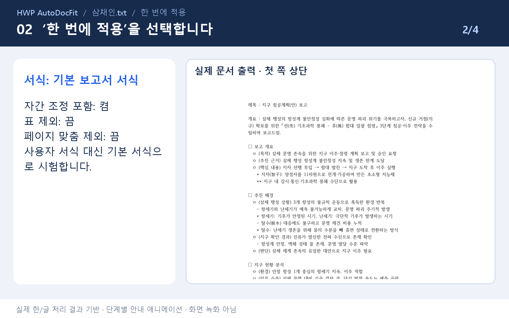
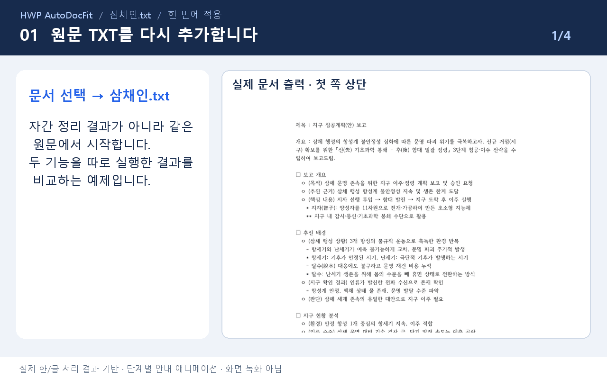
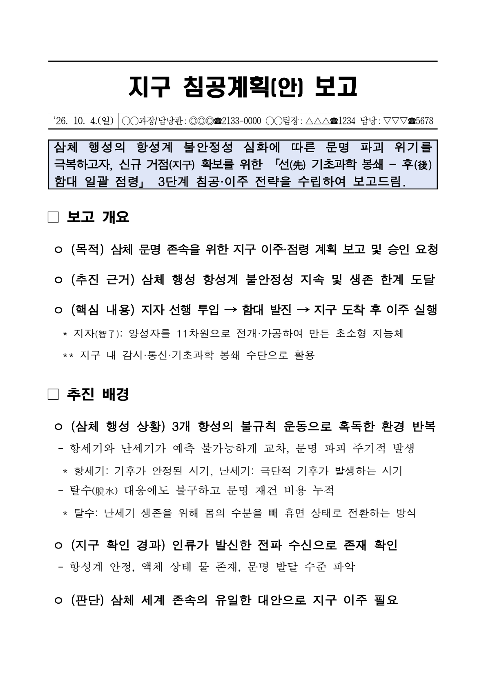
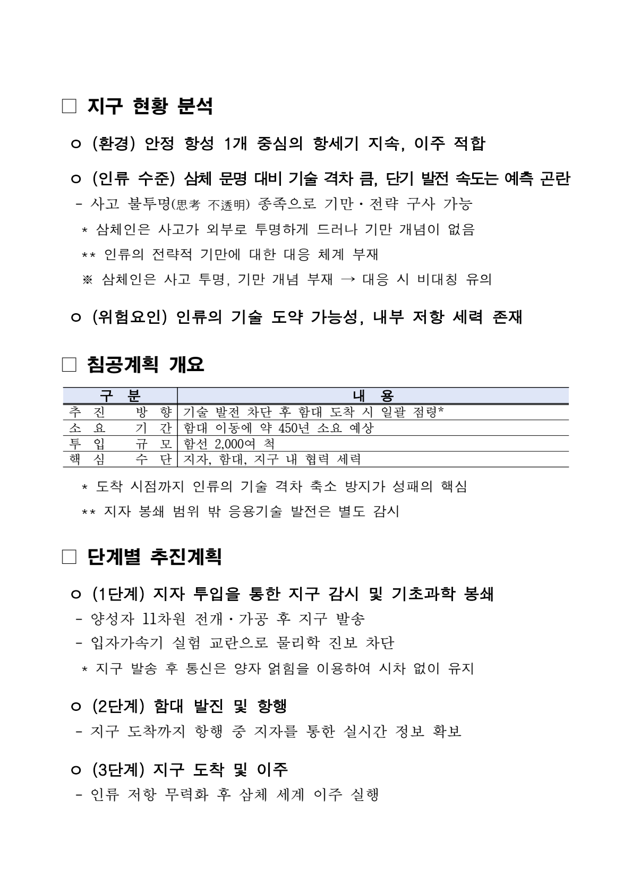
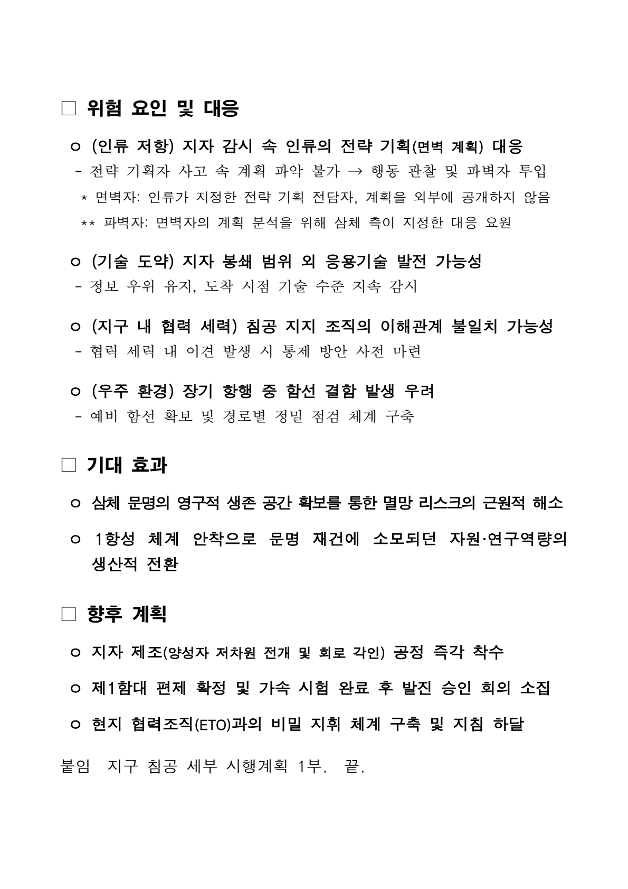

# 한글편집 후처리 도구

다 쓴 한글 보고서의 **줄 끝 단어, 제각각인 글꼴, 문단 정렬과 표 모양**을 정리하는 Windows 프로그램입니다.
문서를 넣고 작업을 고르면 설치된 한/글을 자동으로 조작합니다. **원본은 덮어쓰지 않고, 결과를 새 HWPX 파일로 저장합니다.**

**[Windows 실행 파일 내려받기](https://gitlab.aigov.go.kr/haijun93/hwp_autodocfit/-/releases/permalink/latest)** · [변경 사항](releases/) · [GitHub](https://github.com/haijun93/hwp-auto-docfit) · [GitLab](https://gitlab.aigov.go.kr/haijun93/hwp_autodocfit)

현재 안내 기준: **1.69 Beta 18**. 베타 버전이므로 처음에는 문서 한 개로 시험하고 결과를 확인해 주세요.

## 어떤 결과가 나오나요?

### 1. 자간 정리 — 줄 끝에서 갈라진 단어를 한 줄로

가장 많이 쓰는 기능입니다. 줄 끝에서 `거점(지 / 구)`, `수 / 립하여`처럼 갈라진 단어를 자간을 조금씩 조절해 한 줄에 모읍니다. 글 내용과 서식은 그대로 둡니다.

**[▶ 자간 정리 영상 보기 — 24초](docs/media/samchein/spacing-guide.mp4)** · [예제 파일 받기](docs/examples/samchein/삼채인.txt) · [바로 따라 하기](#examples)

### 2. 한 번에 적용 — 텍스트 초안을 보고서 모양으로

같은 텍스트 초안에 **한 번에 적용**을 실행하면 왼쪽의 텍스트가 오른쪽처럼 제목·개요 표, 기호별 글꼴·간격, 자간까지 정리된 보고서가 됩니다.

**[▶ 한 번에 적용 영상 보기 — 24초](docs/media/samchein/all-guide.mp4)**

> 영상은 **실제 한/글 처리 결과로 만든 단계별 안내 애니메이션**이며 앱 클릭 화면 녹화가 아닙니다. 재생되지 않으면 MP4를 내려받거나 아래 실습의 GIF 안내를 펼치세요. 예제는 **1.69 Beta 18**로 처리한 결과이며, 글꼴·설정에 따라 모양이 달라질 수 있습니다.

처음이라면 **설치 → 예제 한 개 정리 → 결과 비교**까지만 해 보세요. 서식 등록이나 세부 설정은 나중에 사용해도 됩니다.

## 필요한 곳부터 읽으세요

- [처음 설치하기](#install)
- [첫 문서 정리하기](#quick-start)
- [실제 예제로 따라 하기 — 영상·전후 비교](#examples)
- [세 가지 작업 중 고르기](#choose-mode)
- [우리 기관의 예시 서식 등록하기](#formats)
- [결과 파일과 검사 결과 확인하기](#results)
- [문제가 생겼을 때](#help)
- [추가 기능과 지원 파일](#more)
- [개발자용 실행·빌드 안내](docs/DEVELOPMENT.md)

## 1. 처음 설치하기

### 준비할 것

| 항목 | 필요한 내용 |
|---|---|
| 컴퓨터 | Windows 10·11, 64비트 |
| 한글 프로그램 | 문서를 편집할 수 있는 한컴오피스 한/글 설치. 주 검증 환경은 **한/글 2020**입니다. |
| 문서 | 처음에는 HWP 또는 HWPX 문서 한 개로 시작하세요. |
| 설치 권한 | 기관 PC는 프로그램 실행·한/글 자동화 허용 여부를 전산 담당자에게 확인하세요. |

한/글 뷰어만 설치된 PC나 Mac에서는 문서 자동 편집을 사용할 수 없습니다.
NEO·다른 한/글 버전은 설치 환경에 따라 차이가 있으므로 사본으로 먼저 확인하세요.

### 실행 파일로 시작하기 — 일반 사용자

1. 위의 **Windows 실행 파일 내려받기**를 누릅니다.
2. 열린 릴리스 페이지의 첨부 파일에서 **`HWP_AutoDocFit.exe`**를 내려받습니다. `Source code`나 소스 ZIP은 개발용이므로 받지 않아도 됩니다.
3. 내려받은 실행 파일을 보관할 폴더에 두고 두 번 클릭합니다.
4. 앱이 열리면 아래의 **첫 문서 정리하기**를 따라 합니다.

**실행 파일 사용에는 Python 설치나 명령어 입력이 필요하지 않습니다.**
HWP·HWPX의 기본 편집에는 Node.js도 필요하지 않습니다.

> Windows나 기관 보안 프로그램이 실행을 막으면 출처와 기관 정책부터 확인하세요. 보안 기능을 끄거나 무조건 실행을 허용하지 마세요. 다운로드 페이지가 열리지 않으면 전산 담당자에게 접속 가능 여부를 문의하세요.

## 2. 첫 문서 정리하기

먼저 작업 중인 한글 문서를 저장하고, 중요한 문서는 별도로 백업하세요. 이후에는 아래 네 단계만 따라 하면 됩니다. 배포 화면에 따라 버튼 이름은 조금 다를 수 있습니다.

| ① 문서 넣기 | ② 작업 고르기 | ③ 실행하기 | ④ 결과 보기 |
|---|---|---|---|
| **문서 선택 → 문서 추가**. 파일을 끌어 놓아도 됩니다. | **작업 방식**에서 카드 한 개를 선택합니다. | **정리 시작**을 누르고 기다립니다. | **결과 파일 열기**로 원본과 비교합니다. |
| 처음에는 예제 한 개만 | 줄 끝만: **자간 정리** / 보고서 양식까지: **한 번에 적용** | 한/글 작업 창을 편집하거나 닫지 마세요. | 글·표·쪽 나눔을 확인하세요. |

예를 들어 `업무보고.hwp`에 자간 정리를 실행하면 같은 폴더에 `업무보고(자간조정).hwpx`가 생깁니다.
익숙해진 뒤에는 여러 문서나 폴더를 한꺼번에 추가할 수 있습니다.

### 실제 예제로 따라 하기: 삼채인.txt

[연습용 삼채인.txt](docs/examples/samchein/삼채인.txt)를 열고 **Raw/원본 다운로드**로 저장하세요. 삼체 문명을 소재로 한 가상 보고서이며 실제 행정문서가 아닙니다. 아래 두 실습은 **같은 TXT에서 각각 시작**합니다.

**예제 1(자간 정리)부터** 해 보세요. 줄 끝만 고치는 가장 기본 기능입니다. **보고서 모양까지 바꾸려면 예제 2(한 번에 적용)**입니다. TXT에는 원래 서식이 없으므로 비교 이미지의 ‘전’은 앱이 한글 문서로 변환한 직후입니다.

#### 예제 1. 줄 끝에서 갈라진 단어만 정리하기

먼저 아래 이미지의 개요 문장을 보세요. 위에서는 `거점(지 / 구)`, `수 / 립하여`가 두 줄로 갈라지고, 아래에서는 각각 한 줄에 모입니다.

1. **문서 추가**에서 내려받은 `삼채인.txt`를 선택합니다.
2. **자간 정리**를 고릅니다. **기존 자간 초기화: 켬**, **표 제외: 끔**으로 둡니다.
3. **정리 시작**을 누르고 결과 `삼채인(자간조정).hwpx`를 엽니다.
4. 첫 개요 문장의 **거점(지구)**와 **수립하여**가 줄 끝에서 나뉘지 않는지 확인합니다. 이 예시에서는 각각 -3%, -2% 자간으로 앞줄에 모였습니다. 제목·표를 보고서 양식으로 바꾸지는 않습니다.

**[▶ 자간 정리 영상 보기 — 24초](docs/media/samchein/spacing-guide.mp4)**

여기서 움직이는 안내 보기 — GIF 펼치기

움직이는 화면이 불편하면 접고 위의 정지 이미지와 번호 순서를 이용하세요.

#### 예제 2. 텍스트 초안을 보고서 모양으로 정리하기

README 맨 위의 전후 비교처럼 바꾸는 실습입니다. 아래 안내 이미지에서 **선택할 서식과 옵션**을 확인하세요. 실제 앱 화면이 아닌 설명용 이미지입니다.

1. 목록에서 앞 실습 파일을 빼고 **원문 `삼채인.txt`를 다시 추가**합니다. 자간 정리 결과 파일을 넣는 실습이 아닙니다.
2. **한 번에 적용**을 고르고 **기본 보고서 서식**을 선택합니다.
3. **자간 조정 포함: 켬**, **표 제외: 끔**, **페이지 맞춤 제외: 끔**을 확인하고 **정리 시작**을 누릅니다.
4. `삼채인(일괄적용).hwpx`에서 제목·개요 표, `□`·`ㅇ`·`-` 문장, ‘침공계획 개요’의 표를 확인합니다. 박스 문자로 그린 표가 편집 가능한 실제 표로 바뀝니다.

**[▶ 한 번에 적용 영상 보기 — 24초](docs/media/samchein/all-guide.mp4)** · [전후 비교 크게 보기](docs/media/samchein/all-comparison.png)

여기서 움직이는 안내 보기 — GIF 펼치기

움직이는 화면이 불편하면 접고 위의 정지 이미지와 번호 순서를 이용하세요.

이번 실행은 자간 정리 **2쪽 → 2쪽**, 한 번에 적용 **2쪽 → 3쪽**이었습니다. 보고서 글자 크기와 간격을 입히므로 쪽 수가 늘 수도 있습니다. 제목 아래 날짜·담당자·전화번호는 기본 양식의 예시 값이므로 실제 제출 전에 고치세요.

> 자동 검수만으로 완벽한 결과를 보장하지 않습니다. 이 사례의 최종 판정도 ‘부분 달성’입니다. [전체 결과 이미지·검수 한계·재현 방법](docs/examples/samchein/README.md)을 함께 확인하세요.

## 3. 세 가지 작업 중 무엇을 고를까요?

| 원하는 일 | 고를 작업 | 기준 |
|---|---|---|
| 줄 끝에서 갈라진 단어, 마지막 줄의 짧은 글자를 정리하고 싶어요. | **자간 정리** | 현재 문서의 줄 배치 |
| 여러 사람이 쓴 문서에서 유독 다른 글꼴·크기 등을 맞추고 싶어요. | **서식 통일** | 같은 역할의 문장들이 많이 사용한 서식 |
| 정해진 보고서 양식으로 바꾸고 마무리까지 하고 싶어요. | **한 번에 적용** | 기본 서식 또는 내가 등록한 예시 서식 |

**자간**은 글자 사이 간격, **서식**은 글꼴·크기·색·문단 간격·표 모양 등을 뜻합니다.
**내어쓰기**는 둘째 줄부터의 시작 위치를 첫 줄의 본문 시작에 맞추는 방식입니다.

처음에는 위 실습의 옵션으로 시작하세요. 아래 설명은 결과를 조절하고 싶을 때만 펼쳐 읽으면 됩니다.

세 가지 작업의 옵션과 차이 자세히 보기

### 자간 정리

갈라진 단어를 한 줄로 모으고 짧게 남은 마지막 줄을 줄이도록 시도합니다.
안전 한도 안에서 조정하며, 모든 줄을 반드시 맞추는 기능은 아닙니다.

- **기존 자간 초기화**: 이전 자간을 0%로 되돌린 뒤 정리합니다. 기존 조정값을 출발점으로 쓰려면 끄세요. 꺼도 이후 자간 정리는 실행됩니다.
- **표 제외**: 표 칸 안 문장을 자간 정리 대상에서 뺍니다.

### 서식 통일

문서 전체를 한 가지 글꼴로 만드는 기능이 아닙니다. `□` 제목은 `□`끼리, `ㅇ` 문장은 `ㅇ`끼리처럼 **같은 역할끼리 비교**합니다.

예를 들어 `ㅇ` 문장 20개 중 18개가 한컴돋움 15pt이고 2개만 굴림 12pt라면, 다른 2개를 교정 대상으로 삼습니다.
글꼴·크기뿐 아니라 색·기울임·밑줄·정렬·여백 등도 비교하며, 대표값이 불확실한 경우는 확인 대상으로 남길 수 있습니다.

- **표 제외**: 기본 표 서식과 표 서식통일을 뺍니다. 본문만 맞추고 싶을 때 켜세요.
- **자간 정리 제외**: 서식을 고친 문장의 자간 정리·짧은 줄 당기기를 하지 않습니다. 내어쓰기는 별도로 맞춥니다.
- **페이지 맞춤 제외**: 쪽 수를 줄이기 위한 간격 조정을 하지 않습니다. 서식 통일에서는 기본으로 켜져 있습니다.

본문의 정상 문장은 서식 교정을 건너뛰지만, 켜 둔 표 작업이나 배치 작업은 별도로 실행될 수 있습니다.

### 한 번에 적용

**서식 기준**에서 기본 서식이나 저장한 사용자 서식을 고릅니다.
준말 변환, 보고서 서식, 제목·개요·표 정리와 자간 등의 선택된 작업을 순서대로 실행합니다.

- **자간 조정 포함**: 끄면 예전의 **서식 적용** 방식으로 실행합니다. 전체 자간 정리 단계는 빠지지만, 예시 서식의 자간값 적용이나 **개요·한 칸 표 자간 조정** 등은 별도입니다. 자간이 전혀 변하지 않는다는 뜻은 아닙니다.
- **표 제외**: 일반 표 관련 작업을 뺍니다. **제목·개요·중제목·붙임 서식 표는 별도 대상**이므로 함께 제외되지 않습니다.
- **페이지 맞춤 제외**: 문단 간격을 줄여 쪽 수를 맞추거나 관련 문단을 같은 쪽에 모으는 작업을 뺍니다. 글꼴·크기 변경 자체로 생기는 줄바꿈까지 고정하지는 않습니다.

각 카드의 **세부 작업…**에서 실행할 항목을 더 자세히 고를 수 있습니다.
카드 옵션과 관련 세부 작업은 서로 연동되므로, 시작 전에 선택 상태를 확인하세요.

## 4. 우리 기관의 예시 서식 등록하기

**예시 문서**는 모양을 배울 문서이고, **정리할 문서**는 그 모양을 적용할 문서입니다.
내용이 다른 두 문서를 각각 준비해도 됩니다.

1. **작업 방식 → 서식 관리**를 엽니다.
2. **파일에서 고르기**로 예시 HWP·HWPX 문서를 선택하거나, 서식 관리 창에 끌어다 놓습니다.
3. 분석 뒤 열리는 **서식 세부사항**에서 **서식 이름·기관명·대표값**을 확인하고 수정합니다.
4. 저장하면 서식 목록에 추가됩니다. 해당 서식의 **사용**을 눌러 선택합니다.
5. 서식 관리 창을 닫고 **정리할 문서**를 추가한 뒤 **한 번에 적용**을 실행합니다.

> 서식 관리 창에 파일을 놓으면 **처리할 문서 추가가 아니라 서식 등록**으로 동작합니다.

등록할 때 확인할 서식 요소와 수정 기능

| 영역 | 분석·확인하는 주요 항목 |
|---|---|
| 문두기호 문장 | 기호·계층별 글꼴, 크기, 굵게, 색, 자간·장평, 정렬, 여백, 줄·문단 간격 |
| 제목 표 | A1·A2·B2 등 칸별 글자·문단 모양, 테두리, 배경, 안쪽 여백, 세로 정렬 |
| 개요·중제목·붙임 표 | 표 종류별·칸별 서식과 대표값 |
| 일반 표·쪽 설정 | 표의 역할별 서식과 쪽 여백 등 |

칸 이름의 **A·B는 열**, **1·2는 행**입니다. 예를 들어 **B2는 두 번째 열의 두 번째 행**입니다.
병합된 표는 칸 구성이 다를 수 있습니다.

분석 화면에서는 대표값뿐 아니라 표본 수와 다른 값도 확인할 수 있습니다.
**적용 방식**의 **값 복사 / 규칙 복사 / 표시만**을 구별하세요. 표시되는 모든 항목이 그대로 적용되는 것은 아닙니다.

- **세부 수정**: 저장된 서식의 값을 다시 고칩니다.
- **이름 바꾸기**: 목록에 보일 서식 이름과 기관을 바꿉니다.
- **삭제**: 사용자 서식을 지웁니다. 기본 서식은 삭제할 수 없으며, 기본 서식 수정은 새 서식으로 저장합니다.
- **예시 직접 작성**: 참고 문서가 없을 때 한/글에서 예시를 작성해 등록합니다.

**서식 등록은 원본 문서의 완전 복제를 보장하지 않습니다.**
예시에 없는 표 종류는 내장 기준이 사용될 수 있고, 글의 길이·설치 글꼴·표 구조에 따라 줄바꿈과 쪽 수가 달라집니다.
용지 크기·방향은 자동으로 바꾸지 않으므로 다른 경우 처리 기록을 확인하세요.
자세한 범위는 [서식·표 상세 안내](docs/ADVANCED_USAGE.md#format-details)를 참고하세요.

## 5. 결과는 어디에 저장되나요?

기본적으로 **원본 문서와 같은 폴더**에 저장됩니다. 입력이 HWP여도 결과는 HWPX입니다.

### 예제 결과를 눈으로 확인하세요

아래는 ‘한 번에 적용’ 결과의 전체 3쪽입니다. **이미지를 누르면 크게 볼 수 있습니다.** 내 결과도 이런 순서로 확인하세요. 날짜·담당자 예시 값은 실제 값으로 바꿔야 합니다.

| 1쪽: 제목·개요·문단 | 2쪽: 표·추진계획 | 3쪽: 나머지 본문·붙임 |
|---|---|---|
|  |  |  |
| 제목과 개요가 있는지 | 표의 글·숫자와 셀을 확인 | 마지막 문장까지 있는지 |

### 내 결과 파일 찾기

| 실행한 작업 | 결과 파일 예 |
|---|---|
| 자간 정리 | `업무보고(자간조정).hwpx` |
| 서식 통일 | `업무보고(서식통일).hwpx` |
| 한 번에 적용 — 자간 조정 포함 | `업무보고(일괄적용).hwpx` |
| 한 번에 적용 — 자간 조정 제외 | `업무보고(서식적용).hwpx` |

**제출 전에는 다음 세 가지를 확인하세요.**

- 글·숫자·표·그림이 빠지지 않았는지
- 제목·줄 끝 단어·둘째 줄 시작 위치가 자연스러운지
- 쪽 수, 표 잘림, 제목만 쪽 끝에 남는 문제가 없는지

처리 기록과 검사 보고서는 확인을 돕는 자료입니다. **자동 검사를 통과해도 문서가 완벽하다는 뜻은 아닙니다.**

처리 기록·검사 보고서 파일 알아보기

| 기록 | 확인할 내용 |
|---|---|
| 앱의 **처리 기록** | 실행 단계, 제외한 항목, 경고·오류 |
| `(최종검수).json` | 작업 수행 결과와 확인할 문제. 여러 문서 일괄 처리 시 첫 번째 입력 문서 폴더에 전체 작업 보고서를 저장합니다. |
| `(무결성검사).json` | 상세 진단·문서 무결성 검사를 켰을 때 만드는 내용·구조 비교 보고서 |
| `(작업로그-날짜시간).log` | 로그 파일 저장을 켰을 때만 만듭니다. 기본은 꺼짐이며 첫 번째 입력 문서 폴더에 저장합니다. |

JSON은 검사 내용을 담은 텍스트 파일입니다. 처음에는 앱의 결과·처리 기록부터 확인해도 됩니다.

## 6. 문제가 생겼을 때

| 상황 | 먼저 확인할 것 |
|---|---|
| 다운로드가 안 돼요. | GitLab 접속과 기관의 실행 파일 다운로드 정책을 확인하세요. 소스 ZIP은 실행 파일의 대체품이 아닙니다. |
| 앱은 열리지만 문서를 처리하지 못해요. | 한/글에서 해당 문서를 직접 열고 편집할 수 있는지 확인하세요. 뷰어만 설치됐거나 자동화가 차단된 환경일 수 있습니다. |
| **정리 시작**을 누를 수 없어요. | 처리할 문서가 목록에 있는지, 작업 방식을 골랐는지 확인하세요. |
| 처리가 멈춘 것 같아요. | 처리 기록과 한/글의 확인 창을 살펴보세요. 다른 문서를 저장하지 않은 채 한/글 프로세스를 강제 종료하지 마세요. |
| 서식을 골랐는데 적용되지 않아요. | **서식 통일**은 문서 자체가 기준입니다. 등록한 서식을 쓰려면 **한 번에 적용**을 선택하세요. |
| 표나 쪽 배치가 예상과 달라요. | **표 제외**, **페이지 맞춤 제외**, **세부 작업**을 확인하고 원본으로 다시 시험하세요. |
| 빨간 문장이 생겼어요. | 서식 통일에서 대표값을 확정하지 못한 표시일 수 있습니다. 처리 기록을 확인하고 해당 문장을 직접 검토하세요. |
| DOCX·PDF 변환에서 오류가 나요. | 선택형 문서 엔진이 필요한 기능입니다. [추가 설치 안내](docs/ADVANCED_USAGE.md#engine)를 확인하세요. |
| 결과가 마음에 들지 않아요. | 원본은 그대로 있습니다. 기존 결과를 보관하려면 다른 이름으로 복사한 뒤, 원본을 대상으로 옵션을 줄여 다시 실행하세요. |

해결되지 않으면 [GitHub 이슈](https://github.com/haijun93/hwp-auto-docfit/issues) 또는 [GitLab 이슈](https://gitlab.aigov.go.kr/haijun93/hwp_autodocfit/-/issues)에 다음 정보를 남겨 주세요.

- 앱 버전과 한/글 버전
- 선택한 작업·옵션, 파일 형식
- 오류 메시지와 재현 순서

**개인정보·비공개 업무 문서·민감한 내용이 든 로그를 공개 게시판에 올리지 마세요.**
예시 파일이 필요하면 내용을 가린 사본이나 같은 문제가 생기는 새 문서를 사용하세요.

## 7. 익숙해지면 써 볼 기능

| 기능 | 할 수 있는 일 |
|---|---|
| 텍스트 붙여넣기 | 파일 없이 글을 입력해 문서 목록에 추가 |
| 붙여넣은 텍스트 정리 | Markdown 기호 정리, 개조식 문장으로 변환 |
| 아웃라이너로 작성 | Tab·Shift+Tab으로 항목의 상하 관계를 정하며 작성 |
| 작성 도우미 | 금액 한글화, 날짜·요일, 표 계산, 번호 정리 |
| 문서 구조·가독성 검토 | 구조와 서식 차이를 읽기 전용으로 점검 |
| 공공언어·맞춤법 검토 | 내장 규칙이 찾은 후보를 검토하고 승인한 교정만 새 파일로 저장 |
| Markdown 내보내기 | 본문과 표를 다른 도구에서 쓸 수 있는 텍스트 형식으로 내보내기 |

기능 위치와 자세한 예시는 [추가 기능 안내](docs/ADVANCED_USAGE.md)를 참고하세요.
서식 편집은 내용의 사실관계나 모든 맞춤법 오류까지 확인하는 기능이 아닙니다.

### 지원 파일과 추가 설치

- **HWP·HWPX**: 기본 대상입니다. 한/글 설치가 필요합니다.
- **TXT**: 한/글 문서로 변환해 처리합니다.
- **MD·DOC·DOCX·PDF**: 선택형 kordoc 문서 엔진을 사용하는 변환 경로입니다. MD는 엔진 없이 텍스트로 변환할 수도 있습니다.
- **PDF·스캔 문서**: 원래 편집 구조나 서식이 완전히 복구되는 것은 아닙니다. OCR·변환 결과를 확인하세요.

선택형 엔진 설치와 제한사항은 [고급 문서 도구](docs/ADVANCED_USAGE.md#engine)에 정리했습니다.
기본 편집과 내장 문서 검토는 로컬에서 실행합니다. 업데이트 확인·추가 엔진 설치에는 네트워크가 사용될 수 있습니다.

### 업데이트와 설정 보관

새 버전이 있으면 앱이 알립니다. 안내를 확인하고 업데이트하세요.
알림이 오지 않으면 위의 다운로드 페이지에서 최신 배포판을 확인할 수 있습니다.

설정과 사용자 서식은 `%APPDATA%\HwpAutoDocFit`에 저장됩니다.
PC를 옮길 때는 앱을 종료하고 이 폴더를 백업하세요. **서식 파일에는 예시 문서 일부가 포함될 수 있으므로 공유에 주의하세요.**

---

## 개발·상세 문서

일반 사용자는 아래 절차 없이 실행 파일만 사용하면 됩니다.

- [세부 처리 규칙과 추가 기능](docs/ADVANCED_USAGE.md)
- [소스로 실행하기·테스트·EXE 빌드](docs/DEVELOPMENT.md)
- [개발 인수인계](HANDOVER.md) · [UI 설계](UI_DESIGN.md) · [작업 목록](TODO.md)
- [서식 복사 범위와 설계](FORMAT_COPY_DESIGN.md) · [원본 보존·재현 설계](STYLE_FIDELITY_DESIGN.md)

`main`은 베타 배포 브랜치이고 `alpha`는 새 기능 시험 브랜치입니다.
